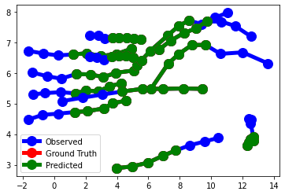
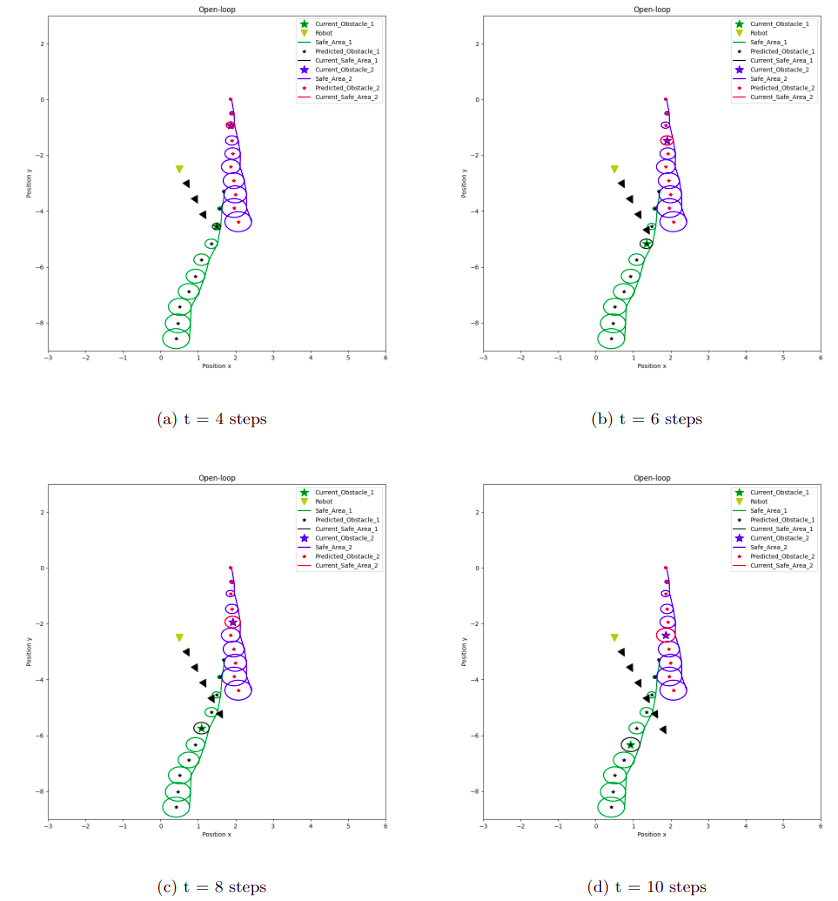

# Trajectory Prediction and Dynamic Obtacle Avoidance for Self Driving Cars

## Abstract

Model Predictive Control (MPC) is a popular framework for autonomous systems. However, to achieve good control
performance using MPC, an accurate dynamics model is quite
necessary. Machine learning approaches, specifically neural networks, have been shown to model even complex dynamics but
have not been quite effective. They are not suited for control
tasks in their original form since they are not designed to
handle variable control actions or variable initial values. Physics informed neural networks (PINNs) impose known physical laws
into the learning of deep neural networks, making sure they
respect the physics of the process while decreasing the demand
of labeled data. In this context, this work explores the idea of
Physics-Informed Neural Nets-based Control (PINC), a unique
control strategy where PINN-based architecture that is amenable
to control problems is used along with MPC. The methodology
enables the optimal control of dynamic systems, making feasible
to integrate a priori knowledge from experts and data collected
from plants in control applications. We showcase our method in
the control of a self driving car with bicycle model dynamics. Our
controller is then put to test against dynamic obstacles to see if
the PINN modelled dynamics can accurately predict state vector
in adverse situations. We use GRU as the trajectory predictors of
the pedestrians, while making no assumptions on the underlying
trajectory-generating distribution. To the best of our knowledge,
these are the first results in such a setting.

## Results
| Errors              | Vanilla LSTM | GRU      |Social LSTM | OLSTM  |
| :----:              |    :----:    |  :----:  |   :----:   | :----: |
|Avg train disp err   |0.771         | 0.7029   |0.333       |0.407   |
|Final train disp err |1.597         | 1.2921   |0.5021      |0.7752  |
|Avg test disp err    |1.2648        |1.3957    |1.2176      |1.236   |
|Final test disp err  |2.755         |2.6529    |2.543       |2.643   |

Using Vanilla LSTM for predicting 4 steps trajectory

Using Vanilla LSTM for predicting 6 steps trajectory

More results and graphs for trajectory prediction are available in [report](./trajectory_prediction_of_pedestrians/report.pdf)

The complete pileline shows below graphs. The circles are the conformal prediction constraints that are proportional to errors in LSTM for that trajectory step. There are two pedestrians and the triangle is our car

## Conclusion and Future scope
We demonstrated our method by taking the case of a
self driving car with bicycle model dynamics. We trained a
PINN model with IPOPT solver in CASADI framework by
generating reference motion vectors, to learn the dynamics.
In cohesion with MPC controller, we designed a Physics
informed neural net contoller.
1) Lifelong A* planning algorithm gave us the desired
reference trajectory when we consider the temporal
data of the pedestrians. The method also proved to
be effective in generating paths that downright avoided
trajectories. Since it is updated at every time step, even
if our control actions predicted by PINN MPC do not
consider obstacles, the reference trajectory they take
make sure they do not collide by adding cost.
2) Coming to trajectory predictions, GRU models
work well with very low error to predict 6 steps in
future. Being computationally effective it can be run in
real time for trajectory prediction.
In future, The primary problem to encounter would be to
make the PINN model robust by training it on relevant data.
Statistical tools need to be used to quantify uncertainty
1) PINNs are capable of predicting trajectories by considering dynamic obstacles too. Hence LSTMs/GRUs could
be integrated so that our robot traverses safely and use
of LPA* could be eliminated.
2) More pedestrians and other types of dynamic agents
(cars, etc) could be introduced into the system so that the model learns how to efficiently predict trajectories
in a crowded place without blowing computationally
3) Design PINN for closed loop MPC and explicitly compare time of computation between methods to prove
PINN’s utility
4) Use Transformers to predict pedestrian’s trajectory. (Social) Transformers can be used to predict more steps into
the future with more certainty while considering pedestrian’s surroundings into account